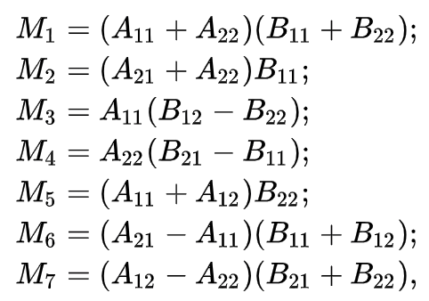

#### Introduction

A matrix is defined as a rectangular array or table of numbers, symbols, or expressions, arranged in rows and columns, which is used to represent a mathematical object or a property of such an object.
Although they may appear to be somewhat straightforward, their applications in mathematics, machine learning, and computer science, are significant.

Attached below is the notation that we'll be using throughout the post. For an example matrix A of size mxn each element index is denoted by the pair (i, j) where i is any value 1 <= i <= m
and j is any value 1 <= j <= n.

#### Matrix Multiplication

Now that we know what a matrix is, what does it mean to multiply two matrices? Let's take the two matrices below, A and B, of size mxn and nxp respectively.

The matrix product AB is defined to be the matrix C of size mxp such that each entry cij is produced by multiplying each element of the ith row of A with 
the corresponding element in the jth column of B, and summing all of these products.

Those familiar with linear algebra will notice that cij could really just be described as the dot product of the ith row of A and the jth column of B.

Thus the resulting matrix C can be denoted as follows.

#### Naive Implementation

Suppose you were tasked to write a program that takes in two matrices (A and B), as input and output the matrix product C. How would you implement such an algorithm?

In our case, we'll consider only square matrices of size NxN to simplify the use-case. 

A naive approach would be to iterate from k = 1 to N while setting each cij element as the sum of the elements aik and bkj. This would
indeed compute the matrix product C as it's a direct representation of how two matrices are multiplied. However, to index each (i, j)th element we would need two nested
loops iterating from 1 -> N which leads results in a rather inefficient asymptotic complexity of O(N2). Add the third N-bounded loop for k to the party
and our final asymptotic complexity sits at a wonderful O(N3).

The graph below shows the runtime (ms) of the naive implementation with gradually increasing input sizes. On the x-axis is the number of iterations which also servces as the
edge length of the input matrix as well. For example, iteration 80 represents the runtime of the algorithm with input matrices of size 80x80.

#### Strassen's Algorithm

Tired of watching the paint dry while his colleagues multiplied matrices at O(N3) speed, Volker Strassen an esteemed German mathematician developed an algorithm 
that computes the matrix product slightly more efficiently.

Referring to the introductory information presented at the start of this post, suppose you are multiplying matrices A and B whose dimensions are both 2x2. The resulting
matrix produced through the naive method would be:

However, notice that this algorithm requires 8 muiltiplication operations (2^3). Strassen's method, however, involves the use of 7 new matrices denoted M1, M2, 
..., M7 pictured below.

Using these these 7 new matrices, the matrix product C is instead created through a series of addition/subtraction operations.
This reduces the total number of multiplications from 8 to 7, reducing the asymptotic complexity from O(N3) to O(N2.807).

We recursively repeat this method until the matrices degenerate to numbers. Therefore we've added a helper function split() used to split an input matrix into four equal quadrants
returned as a tuple.

The implementation of Strassen's Algorithm follows directly from the mathematic steps repeated recursively on each sub-matrix. Each resulting matrix C is produced by horizontally and 
vertically stacking each quadrant.

It's important to note that Strassen's Algorithm requires the input matrix lengths to be a power of 2. This means that when running the tests our x-values will be constrained to
powers of 2 giving us slightly less data.

#### What do we observe at Small Values?

As an experiment, we can plot the runtime (ms) of both algorithms repeatedly to find a suitable average. Again, it's important to note another constraint that these runtimes will vary
drastically between machines.

The below graph shows the runtimes (ms) of both algorithms over 30 iterations with an input size of 64x64.

Are we seeing this correctly? The naive algorithm is outperforming Strassen's by a factor of almost 3 to 1. Using a slightly larger input size of 128x128, let's see if our observation 
changes at all.

#### Discussion

How did the Naive algorithm outperform Strassen's?

Despite Strassen's algorithm having a lower complexity of O(N2.807) compared to the naive algorithm's O(N3) it's important to note that this shouldn't
be taken as the sole factor contributing to an algorithm's performance.

In our case, what we witnessed was the <b>threshold</b> under which the naive should be outperforming Strassen's. Although Strassen's algorithm has a lower complexity, it achieves this
through the implementation of massive O-constants. Not only does it have the massive overhead of the recursive calls, but each call recurses down to 1x1.

This means that for Strassen's algorithm to begin outperforming the Naive, it would have to be handling large enough matrices so that the saved asymptotic complexity outweighs the huge
O-constants being used. Unfortunately, my 2020 MBP was unable to handle such large inputs (ie. a sample naive crashed at 838 minutes running) so a graph can't be provided but experiments have
shown the threshold to be somewhere near 1024x1024 matrices. However, as modern computer hardware continues to evolve and more optimal architectures are implemented, this threshold continues
to increase.

In addition, Strassen's algorithm isn't suited for use involving sparse arrays which further reduces its practicality.

Thus, unless you're dealing with truly massive matrix products, it looks like the Naive algorithm is the way to go. 
Further research has been done with the discovery of the Coppersmith-Winograd algorithm.

Source code available here: https://github.com/JoshuaPark823/StrassenAlgorithm_NaiveMatrixMult

#### References

- https://numpy.org/doc/stable/reference/generated/numpy.polyfit.html
- https://matplotlib.org/stable/tutorials/introductory/pyplot.html
- https://en.wikipedia.org/wiki/Strassen_algorithm
- https://en.wikipedia.org/wiki/Computational_complexity_of_matrix_multiplication
- https://www.geeksforgeeks.org/strassens-matrix-multiplication/